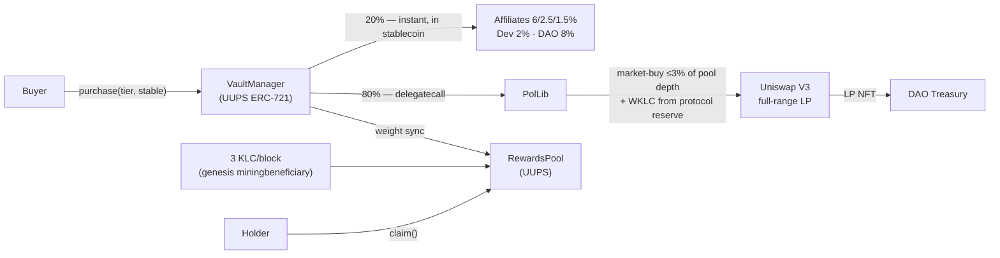

# vaults-core

-363636?logo=solidity)


Smart contracts for **Kaly Vaults** ([vaults.kalychain.io](https://vaults.kalychain.io)) — vault NFTs on [KalyChain](https://kalychain.io), an EVM L1: a one-time purchase that becomes permanent protocol liquidity and earns native block rewards up to a fixed USD return cap.

Each purchase is split atomically in a single transaction: **80% becomes permanent protocol-owned liquidity** (a full-range Uniswap V3 position minted to the DAO treasury), the rest pays a 3-level on-chain affiliate program and protocol fees. Holders then earn a share of the chain's native block rewards — streamed by weight, **capped in USD per vault** — until the vault matures.



## Contracts

Three contracts (OpenZeppelin Upgradeable 4.9.6, Solidity 0.8.19, `viaIR`):

- **`VaultManager.sol`** — UUPS ERC-721. 8-pack tiered sale; 80/20 split; **seeded-bootstrap POL**: each purchase deploys its full 80% as liquidity in-tx, market-buying only a depth-bounded WKLC slice (≤3% of pool depth, sandwich-resistant) and drawing the remainder from a protocol WKLC reserve. Registers each vault's USD ROI cap on purchase; `_beforeTokenTransfer` re-settles reward weight so NFT trades never break accounting; strict admin/operator role split with DAO-bounded operator setters.
- **`RewardsPool.sol`** — UUPS. Receives native KLC block rewards directly from the chain (genesis `miningbeneficiary`); Synthetix-style balance-delta accrual over per-holder weight; rewards accrue in KLC but are **capped in USD per vault** — on hitting its cap a vault matures and its weight is recycled to remaining holders. Weight mutations are gated to `WEIGHT_UPDATER_ROLE`, held only by VaultManager.
- **`PolLib.sol`** — stateless library the VaultManager `delegatecall`s (it runs in the manager's storage context; the manager's WKLC balance *is* the reserve). Holds the POL deployment math — extracted to keep VaultManager under the 24 KB EIP-170 bytecode limit.

### The 80/20 split (per $1 activated)

| Bucket | % | On-chain destination |
|---|---|---|
| Permanent liquidity (POL) | **80%** | full-range V3 LP minted to DAO Treasury |
| Affiliate L1 / L2 / L3 | 6% / 2.5% / 1.5% | paid instantly in the purchase stablecoin |
| Core dev | 2% | dev recipient |
| DAO treasury | 8% | DAO treasury |

Unqualified affiliate legs route to the DAO. If the WKLC reserve runs short, purchases still succeed with under-seeded POL ("degraded mode") — liveness is never held hostage to the reserve.

### The 8 packs

| Pack | Activation | APR (KLC) | ROI cap |
|---|---|---|---|
| Starter | $50 | 30% | 150% |
| Basic | $100 | 40% | 200% |
| Pro 1K | $1,000 | 50% | 250% |
| Pro 5K | $5,000 | 60% | 300% |
| Premium 10K | $10,000 | 70% | 350% |
| Premium 25K | $25,000 | 80% | 400% |
| Elite 50K | $50,000 | 100% | 500% |
| Whale 100K | $100,000 | 140% | 700% |

Block reward is a flat **3 KLC/block, no halving** — enforced by chain config, not these contracts (RewardsPool only measures balance deltas, so it can never be fooled about income).

## Design notes

- **Single-tx POL, no async keeper dependency** — the liquidity a buyer pays for exists before their transaction ends.
- **Depth-bounded market buys** — the in-tx swap is capped at 3% of live pool depth and checked against an operator-set reference price with DAO-bounded deviation/slippage ceilings (`VM: ref price out of band`, `VM: bps too high`), so a compromised operator cannot widen its own limits.
- **USD-capped emissions** — APR is paid in a volatile asset (KLC) but the liability is bounded in USD per vault; total system weight is capped (`maxTotalWeight`) with a DAO-set ceiling.
- **Upgrade discipline** — UUPS with storage gaps; layout validated via `scripts/upgrade-audit.ts` (`STAGE=validate`) before any proposal; upgrades ship through the DAO Governor/Timelock.

## Verification & testing

Every property that guards funds is tested at multiple levels:

| Layer | What | Where |
|---|---|---|
| Unit + integration | **101 passing specs** — purchase paths, MLM edge cases, maturity, hardening, audit-fix regressions | `test/*.spec.ts` |
| Stateful invariants | **6 Foundry invariants** (solvency, weight conservation, reserve bounds, maturity monotonicity) — 256 runs × 16,384 calls, 0 reverts | `test-foundry/` |
| Property fuzzing | Echidna + Medusa harnesses over RewardsPool accrual | `test-foundry/fuzz/` |
| Symbolic execution | Halmos proofs (bounded + full) of accrual properties | `test-foundry/halmos/` |
| Static analysis | Slither + Aderyn, findings triaged to zero actionable | — |
| Mainnet-fork | POL feasibility + live V3 ABI sanity (`FORK=1`) | `test/fork/` |

```bash
npm install
npx hardhat compile
npx hardhat test                                   # 101 specs, ~20s
forge test                                         # 6 invariants (fuzz campaigns)
FORK=1 npx hardhat test test/fork/POL.fork.spec.ts # mainnet-fork POL feasibility
```

> These contracts have been through an internal security pass (static analysis, multi-engine fuzzing, symbolic execution) but **no external audit**. No warranties — use at your own risk.

## Deployments

### KalyChain Testnet (chainId 3889) — live

| Contract | Address |
|----------|---------|
| VaultManager (UUPS proxy) | `0xb02f6b79CbB549F188c90f83035dD295d8AdF082` |
| RewardsPool (UUPS proxy) | `0x57616e82d871Fc2f89F57352274b5A80940d7A28` |
| PolLib | delegatecall target of VaultManager |

Enabled testnet stables (all with seeded WKLC V3 pools, fee 0.3%): KUSD `0xd15F…4c36`, USDT `0x6Fdb…fdD2`, DAI `0x1e7B…35F3`, USDC `0x148d…1013`. External deps (WKLC, router, NPM, factory) are pinned in [`scripts/deploy.config.ts`](scripts/deploy.config.ts).

### KalyChain Mainnet (chainId 3888)

Launch is staged — the full mainnet config (USDT + KUSD only) lives in [`scripts/deploy.config.ts`](scripts/deploy.config.ts); proxy addresses will be published here at deploy.

## Scripts

`deploy-v2-stack.ts` is the single config-driven deploy: it reads the per-network block from `deploy.config.ts` by chainId and runs the identical path on testnet and mainnet. The POL reserve is funded as a separate step by the funder.

```bash
# Full stack deploy (PolLib + VaultManager + RewardsPool, wired + configured)
npx hardhat run scripts/deploy-v2-stack.ts --network testnet

# Create + seed the WKLC/stable V3 POL pools
KLC_USD=0.0024 FEE=3000 npx hardhat run scripts/seed-pools.ts --network testnet

# Fund the WKLC POL reserve (payable, auto-wraps native KLC)
VAULT_MANAGER=0x... RESERVE_KLC=... npx hardhat run scripts/fund-reserve.ts --network mainnet
```

## Layout

```
contracts/            VaultManager, RewardsPool, PolLib (+ interfaces/, mocks/)
scripts/              config-driven deploy, pool seeding, reserve funding, upgrade audit, NFT metadata
test/                 Hardhat specs (unit, integration, hardening, audit regressions, fork)
test-foundry/         Foundry invariants + Echidna/Medusa fuzz + Halmos symbolic
metadata/             vault NFT metadata (tier 0–7)
```

## License

MIT
